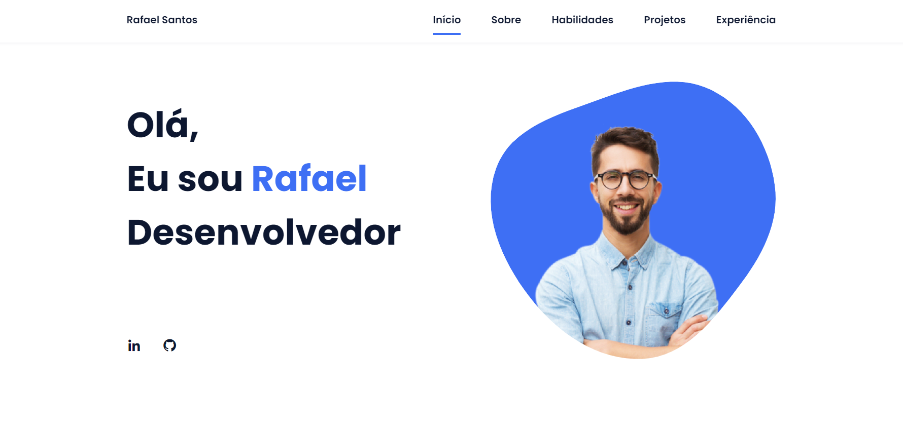
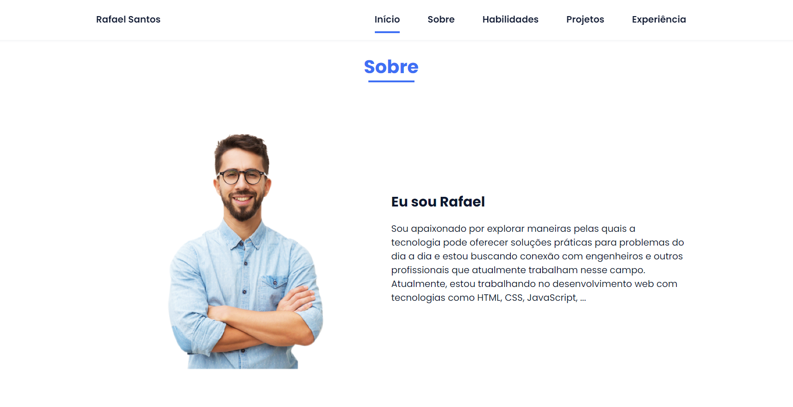
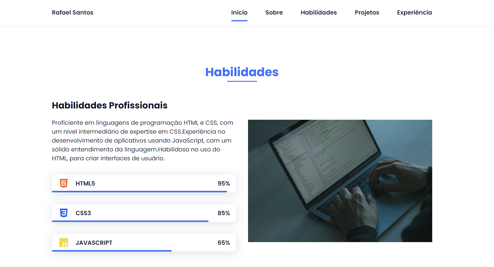
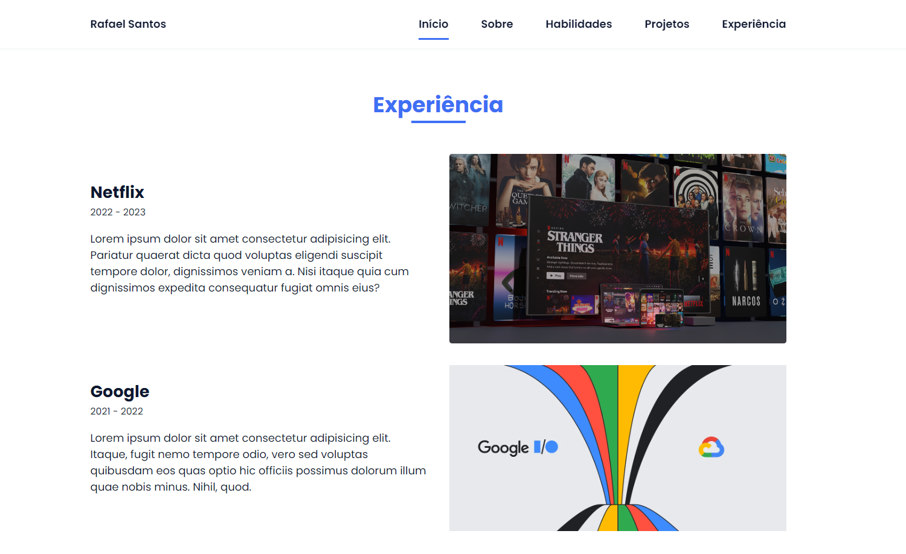
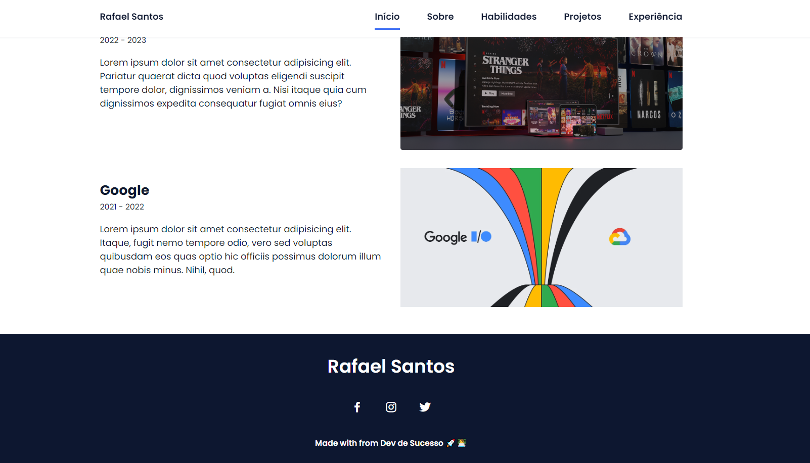

## Portfólio Responsivo Dev de Sucesso 🚀

<table align="center">
  <tr>
    <td>
      
    </td>
    <td>
      
    </td>
    <td>
      
    </td>
  </tr>
  <tr>
    <td>
      
    </td>
    <td>
      
    </td>
    <td>
      
    </td>
  </tr>
</table>

## ✨ Tecnologias

Esse projeto foi desenvolvido com as seguintes tecnologias:

- [HTML]
- [CSS]

## 💻 Projeto

Portfólio desenvolvido para ajudá-lo a exibir e compartilhar facilmente seus trabalhos, projetos e conquistas. Ele fornece uma maneira simples e elegante de destacar seu talento e experiência profissional.

<h1 align="center">
   />
</h1>